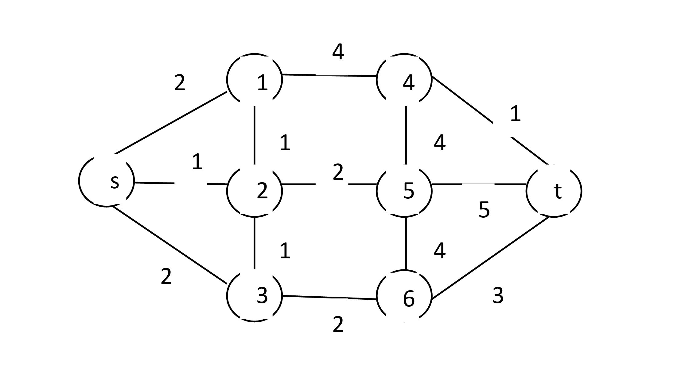
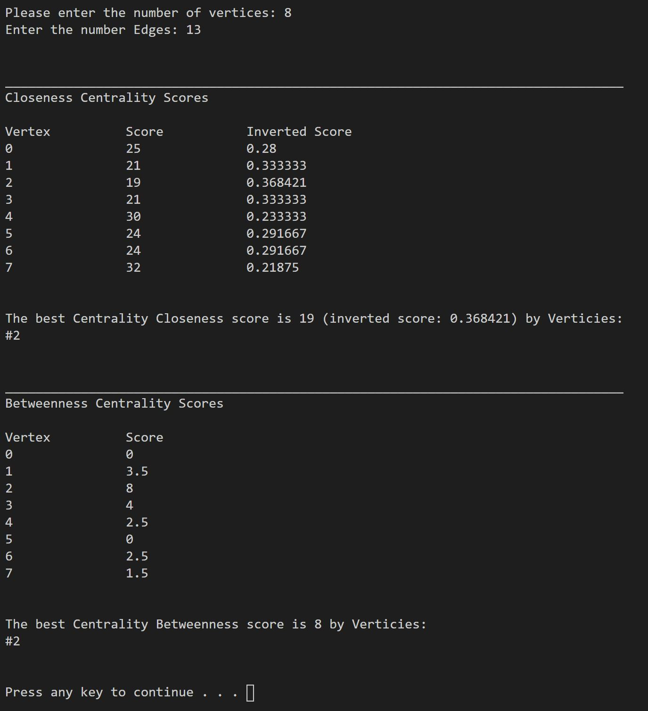

# Modified-Dijkstra-Centrality-Closeness-Betweenness
This project was created for Graph-Based Analysis for Big Data in Social Networks class at College of Staten Island (CUNY) in December 2020.

## Authors
- <a href="https://github.com/konstantinNovichenko">Konstantin Novichenko</a>
- <a href="https://www.linkedin.com/in/louis-petingi-90b27043/">Louis Petingi</a> (starter code)

## Overview
This project is a modification of the classic Dijkstra Shortest Path (DSP) algorithm to find the closeness centrality and betweenness centrality in a network (weighted graph). 
As an input, the user needs to provide the number of vertices, the number of edges in the network, and a text file with the network's representation in the following format: node index, next node index, the weight of the edge. 
The program will analyze the graph, print all the closeness and betweenness scores for each vertex, and indicate which vertices have the best scores. 
The original code with the classic representation of the DSP algorithm was provided by Professor Louis Petingi.

## Content
- Source code in "SourceCSC769.cpp"
- Test case network in "grid.txt"

## Screenshots

### Test Case Network

### Output

